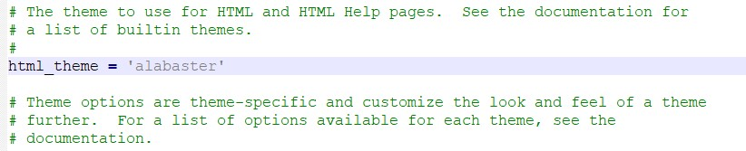

==============================
修改Sphinx主题
==============================

1.	打开 *source* 文件夹中的conf.py，并找到主题配置行 ``html_theme = ‘alabaster’`` 。

.. image:: 4.jpg
     :width: 500px

    

**默认主题的样式如下：**

2.	从内置主题中挑选需要的主题，如 bizstyle，将其改为 ``html_theme = ‘bizstyle’`` ，并保存文件。

3.	重新运行发布命令后，则可得到新主题的样式的帮助文档。

**▲注：**

1. 更多的Sphinx内置主题样式可见：
http://www.sphinx-doc.org/en/master/theming.html#using-a-theme。

2. 还可以安装其他主题，或者按照需要制作自己的主题。