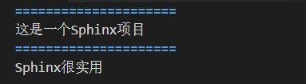
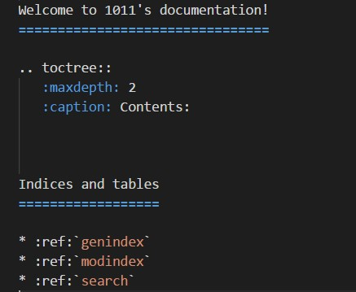
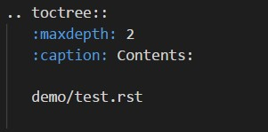

=====================================
在Sphinx项目中添加内容
=====================================

1. 浏览至 *source* 文件夹，并在其根目录下创建新文件夹 *demo*。
2. 在上方 *demo* 文件夹中，新建一个test.rst文件，并在其中输入内容。

例如：可以打开新建的test.rst文件中输入以下内容：

3. 在test.rst文件中输入内容之后点击 文件>保存 进行保存。 
4. 打开source文件中的 index.rst，将刚刚建好并输入内容的test.rst文件添加至目录中，具体如下：

（1）在打开index.rst文件后，会显示出如下界面：

（2）在Contents下面空一行，然后输入test.rst文件的路径，**注意对齐**！！（此处例子的test.rst路径为 demo/test.rst），之后将文件保存。

5. 在Terminal中运行编译命令 ``sphinx-build -b html source build`` ，编译成功的话，在 *build* 文件夹中则会有刚才发布的网站。